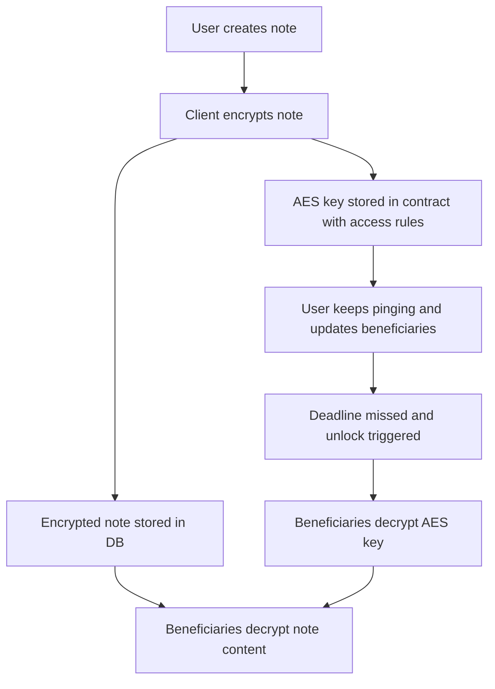

# Afternote FHE

Afternote FHE is a privacy-preserving deadman switch for encrypted notes, credentials, and recovery material.

The idea is simple: a user encrypts sensitive data ahead of time, keeps the vault active by checking in, and lets the protocol release access to chosen recipients only if the unlock condition is met.

## Status

This repository currently captures the product idea and system design. It does not include a working implementation yet.

## Why this exists

A lot of important data has the same failure mode:

- wallet recovery material gets lost
- credentials die with one person
- personal instructions are trapped behind a single key
- existing inheritance and recovery flows rely on lawyers, custodians, or plain trust

Most existing tools can encrypt data, but they do not offer programmable release conditions with privacy preserved throughout the flow.

## Need for this

One useful way to think about Afternote FHE is as a decentralized dead letter service.

If someone disappears, loses access, becomes incapacitated, or simply cannot communicate in time, the right people may still need the right information. That could mean:

- recovery instructions for family
- private notes that should only be delivered if the owner goes inactive
- credentials or operational secrets needed by a team
- wallet or account recovery material that should not depend on a single trusted intermediary

The core idea is:

> Ensure the right people know the right things if you ever cannot tell them yourself.

Afternote FHE is trying to do that in a way that is:

- decentralized
- privacy-preserving
- triggered by inactivity
- safer than handing everything to one custodian ahead of time

## What Afternote FHE is trying to do

Afternote FHE combines client-side encryption, FHE-based access control, and smart contract logic:

- the note itself is encrypted on the client
- encrypted note ciphertext is stored off-chain
- the contract stores an FHE-protected AES key
- the owner periodically proves they are still active
- if the inactivity threshold is crossed, the contract grants access to the intended beneficiaries

The important design choice is that this is not "put plaintext on-chain, but hidden." It is a hybrid system where the contract coordinates access while the sensitive payload stays encrypted.

### High-level flow

```text
user creates a note
-> note content is encrypted on the client
-> encrypted note is stored in a database or off-chain storage
-> AES key is protected in the smart contract with access rules

user can keep pinging to stay active
-> user can update recipients or beneficiaries before unlock

if the ping deadline is missed
-> a keeper, oracle, or backend service triggers unlock
-> beneficiaries can decrypt the AES key through the contract
-> beneficiaries use that key to decrypt the note content
```

### Architecture diagram



## Why FHE is useful here

Plain encryption alone is not enough for this use case. We also need a way to enforce who can decrypt and when that access becomes available.

FHE helps because it lets the system manage encrypted values and access rules without exposing the secret in normal contract execution. That makes the protocol more interesting than a basic encrypted note app or a standard password vault.

## Core design

### 1. Client

The client is responsible for:

- encrypting the note or secret before upload
- decrypting the note after recovery
- preparing the encrypted input needed by the FHE-enabled contract

For larger content, the practical design is hybrid encryption:

- encrypt the note with AES on the client
- store the ciphertext off-chain
- protect the AES key through the FHE flow

This matters because FHE contracts are better suited to encrypted primitive values than arbitrary document storage.

### 2. Smart contract

The contract is responsible for:

- vault creation
- tracking the owner and beneficiaries
- tracking the last active timestamp
- enforcing the inactivity threshold
- granting beneficiary access when unlock conditions are satisfied

One important constraint from the design work is that beneficiary access should be granted at unlock time, not upfront. Before unlock, the contract can freely add or remove beneficiaries from its own list. Once access to a specific encrypted value is granted, that grant should be treated as durable for that ciphertext, so timing matters.

Conceptually, the contract state looks something like this:

```solidity
struct Vault {
    encryptedAesKey;
    storageRef;
    owner;
    beneficiaries;
    lastActive;
    threshold;
    unlocked;
}
```

### 3. Storage layer

The storage layer keeps the encrypted note ciphertext. This can be:

- IPFS
- a database
- another blob storage service

Even if storage is compromised, the attacker only gets ciphertext.

### 4. Optional backend

An optional backend can listen for contract events and send reminders or notifications. It is not part of the trust boundary for protecting the secret itself.

## Vault lifecycle

### Create vault

The owner encrypts a note locally, stores the ciphertext off-chain, and creates a vault with:

- the FHE-protected AES key
- the beneficiary list
- an inactivity threshold

The owner should retain access from the start.

Example flow:

```text
noteCiphertext, aesKey = aesEncrypt(note)
storageRef = storeOffchain(noteCiphertext)
encryptedKey = fheEncrypt(aesKey)

vault.encryptedAesKey = encryptedKey
vault.storageRef = storageRef
vault.owner = msg.sender
vault.beneficiaries = recipients
vault.lastActive = now
vault.threshold = chosenThreshold
vault.unlocked = false

allow(owner, vault.encryptedAesKey)
```

### Active phase

While the owner is active, they periodically call a heartbeat function such as `ping()`. They can also update the beneficiary list during this phase.

```solidity
function ping(vaultId) {
    require(msg.sender == vault.owner);
    require(!vault.unlocked);
    vault.lastActive = block.timestamp;
}
```

### Unlock phase

If the owner does not check in before the threshold expires, the vault becomes eligible for unlock. At that point, a keeper, oracle, or backend service can call the unlock path, and the contract grants the beneficiaries access to the encrypted AES key associated with that vault.

```solidity
function unlock(vaultId) {
    require(!vault.unlocked);
    require(block.timestamp - vault.lastActive > vault.threshold);

    vault.unlocked = true;

    for beneficiary in vault.beneficiaries {
        allow(beneficiary, vault.encryptedAesKey);
    }
}
```

### Recovery

An authorized beneficiary fetches the encrypted payload, recovers the needed key material through the FHE flow, and decrypts the original note client-side.

```text
encryptedKey = readFromContract(vaultId)
storageRef = readStorageRef(vaultId)
noteCiphertext = fetchOffchain(storageRef)

aesKey = recoverThroughFheFlow(encryptedKey)
note = aesDecrypt(noteCiphertext, aesKey)
```

## MVP scope

The most reasonable first version looks like this:

- support for 3 to 5 notes per user
- support for 1 to 2 beneficiaries per note
- encrypted note ciphertext stored off-chain
- heartbeat-based inactivity tracking
- add and remove beneficiaries before unlock
- owner access preserved throughout
- beneficiary access granted only after unlock

## Where the project can grow

Once the basic vault works, the same model can support more advanced recovery logic:

- oracle-assisted auto unlock
- editing notes before unlock
- deleting notes safely before unlock
- archiving older notes and vaults
- support for more recipients per note
- support for richer media such as images, documents, videos, and audio
- time-based unlock options alongside inactivity-based unlock

## Roadmap

### Milestone 1: Basic MVP

- support creating a basic encrypted note vault
- support 3 to 5 notes per user
- support 1 to 2 beneficiaries per note
- store ciphertext off-chain
- implement heartbeat-based inactivity tracking
- unlock to beneficiaries after inactivity

Exit criteria:
one user can create notes, stay active with `ping()`, and let a beneficiary recover a note after the unlock condition is met.

### Milestone 2: Edit, Delete, Archive, and Auto Unlock

- support editing notes before unlock
- support deleting notes before unlock
- support archive logic for inactive or completed notes
- add cleaner auto unlock execution after inactivity
- improve beneficiary management around the unlock path

Exit criteria:
the MVP supports the main note lifecycle beyond creation: edit, delete, archive, and automatic unlock.

### Milestone 3: Reminders, Emails, Media Support, and Time-Based Unlock

- add reminder flows before inactivity expiry
- send unlock notifications or emails to beneficiaries
- support richer media such as images, documents, videos, and audio
- add time-based unlock options
- improve the client recovery experience

Exit criteria:
the product feels usable for real personal and team scenarios, not only for plain-text notes.

### Milestone 4: Product Hardening

- add tests for contract and client flows
- improve edge-case handling around unlock and recovery
- refine storage and recovery assumptions
- improve event handling and operational reliability

Exit criteria:
the core feature set is stable enough for broader demos and external testing.

### Milestone 5: Expanded Recovery Product

- scale beyond the MVP note and beneficiary limits
- support more recipients per vault
- polish archive and recovery workflows
- improve media handling and delivery paths
- prepare the system for production-style deployment and feedback

Exit criteria:
Afternote FHE works as a fuller dead letter and encrypted recovery product rather than only a narrow MVP.

## What makes this different

Afternote FHE is not just an encrypted notes app, and it is not just a deadman switch.

The more interesting version of the project is a programmable recovery vault:

- secrets stay encrypted end to end
- release conditions are enforced by contract logic
- access can be delayed until a recovery condition is met
- the system does not rely on a single trusted custodian

That is the core product idea this repository is centered on.

## License

MIT
