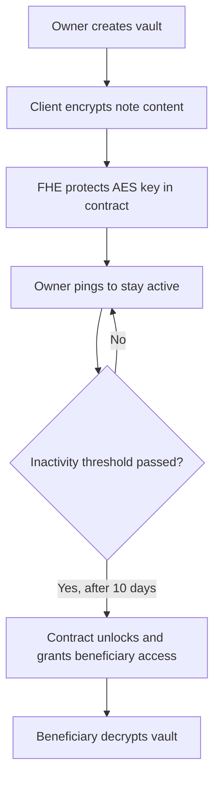

# Afternote FHE

Afternote FHE is a privacy-preserving deadman switch for encrypted notes, credentials, and recovery material.

The idea is simple: a user encrypts sensitive data ahead of time, keeps the vault active by checking in, and lets the protocol release access to chosen recipients only if the unlock condition is met.

## Current Implementation Status

The MVP is now functional with core features deployed and integrated:

**Smart Contract (Solidity on Fhenix)**

- Vault creation with encrypted AES key and IV protection using FHE
- Multi-beneficiary support (up to 3 per vault)
- Heartbeat mechanism (`ping`) to prove owner activity
- Automatic unlock after inactivity threshold (10 days)
- Vault updates (content, beneficiaries, encryption keys)
- Event-based state tracking

**Frontend Client (React + Vite)**

- Landing page with onboarding flow and Web3 wallet integration
- Vaults list view with status filtering and sort controls
- Vault creation page with beneficiary selection
- Vault details page with metadata, timeline, and actions
- Vault decrypt page with guided UI for beneficiary recovery
- Ping action to reset inactivity timer
- Update vault functionality
- Reown AppKit integration for wallet connectivity
- Ant Design component library for polished UI
- Version: v0.0.4

**Indexing Layer (The Graph Subgraph)**

- Vault event indexing (VaultAdded, VaultUpdated, VaultPinged, VaultReleased)
- GraphQL API for efficient vault querying and filtering
- Deterministic vault ID generation and release timestamp computation

**Tech Stack**

- Contract: Solidity 0.8.34 with FHE primitives (CoFHE SDK from Fhenix)
- Frontend: React 19, Vite, TanStack Router, Ant Design, GraphQL-Request
- Indexing: The Graph Subgraph (AssemblyScript) on Sepolia
- Cryptography: Client-side AES-128 encryption, FHE-based access control
- Web3: ethers.js v6, Reown AppKit for wallet management

## Why This Matters

**Problem:** Important data (wallet recovery, credentials, personal instructions) gets lost or stuck behind a single key. Existing inheritance flows rely on lawyers, custodians, or blind trust.

And, Plain encryption isn't enough—we need to enforce _who_ decrypts and _when_. FHE lets the contract manage encrypted values and access rules without exposing secrets during execution, making release conditions programmable and trustless.

**Solution:** A decentralized dead letter service that ensures _the right people know the right things if you ever cannot tell them yourself_.

**Core Features:**

- Client-side AES-128 encryption of vault content
- FHE-protected encryption keys stored in smart contract
- Heartbeat-based inactivity tracking
- Automatic beneficiary access grant on unlock
- No plaintext stored on-chain; hybrid private/on-chain model

**Use Cases:** Recovery instructions for family, operational secrets for teams, wallet recovery material, private messages with conditions

## High-Level Flow



## Getting Started

### Deploying Contract (Optional)

This project is scaffolded using [hardhat](https://hardhat.org/docs). Please refer to the documentation for more information on folder structure and configuration.

```bash

npm install

npx hardhat keystore set PRIVATE_KEY

npx hardhat compile

npx hardhat ignition deploy ignition/modules/Afternote.ts --network sepolia

# run end-to-end tests
npx hardhat run --network sepolia scripts/e2e.ts
```

### Running Client

```bash
cd client

npm install'

npm run dev
```

### Demo

#### Vault List View


#### Vault Details & Update


#### Beneficiary Decrypt Page


#### Vault Creation with Beneficiaries


## Implementation Architecture

### 1. Client Layer (React Application)

The frontend handles user interactions and cryptographic operations before data reaches the blockchain:

- Encrypts notes with AES-128 on the client before upload
- Prepares encrypted key/IV using Fhenix SDK for FHE contract input
- Manages wallet connection via Reown AppKit
- Displays vault status with countdown timers and unlock eligibility
- Enables vault updates and ping actions
- Decrypts vaults after recovery using the FHE-decrypted key material

Current pages:

- Landing page: Onboarding and wallet connection
- Vaults list: Overview of all vaults with status indicators, filtering, and sorting
- Create vault: Form to add beneficiaries and encrypt content
- Vault details: View status, take actions (ping/update/decrypt), see timeline
- Vault decrypt: Guided decryption interface for beneficiaries with vault metadata

**Vault Status Guide:**

Understanding vault statuses helps users manage their vaults and track unlock readiness:

- **Active** (green): Vault is regularly pinged and not approaching unlock. Beneficiaries will not gain access for an extended period.
- **Warning** (orange): Vault is nearing the 10-day inactivity threshold. Owner should ping soon to prevent accidental unlock. Beneficiaries will gain access within 3 days if no activity occurs.
- **Overdue** (red): Inactivity threshold has been exceeded. Vault is eligible for beneficiary access. Owner can still ping to reset the timer, or beneficiaries can request release.
- **Released** (blue): Vault has been unlocked and beneficiaries now have access to decrypt the content. No further modifications possible.
- **Personal** (cyan): Vault owned by user with no beneficiaries configured. Acts as a secure personal note storage without recovery delegation.
- **Received** (badge): Vault is shared with user as a beneficiary. Shows vaults from other owners where user can decrypt content if released.

### 2. Smart Contract Layer (Fhenix Blockchain)

The contract enforces access rules and manages encrypted state:

```solidity
struct Vault {
    euint128 encryptedKey;        // FHE-protected AES key
    euint128 encryptedIv;         // FHE-protected initialization vector
    bytes ciphertext;              // Encrypted vault content (stored on-chain for MVP)
    address[] beneficiaries;       // Recipients who can decrypt on release
    uint64 lastActiveAt;           // Timestamp of last ping
    bool isReleased;               // Release state flag
}
```

Contract functions:

- `addVault()`: Create new vault with encrypted key/IV and beneficiary list
- `updateVault()`: Modify content, key, or beneficiaries (before release)
- `ping()`: Update `lastActiveAt` to prove owner activity
- `release()`: Grant beneficiary access after inactivity threshold
- `getVaults()`: Retrieve all vaults for owner
- `getVaultById()`: Retrieve specific vault details

Key constraints:

- Max 3 beneficiaries per vault (configurable)
- 10-day inactivity threshold for release (configurable)
- Beneficiary access granted only at unlock time, not before
- Once released, vaults cannot be modified

### 3. Cryptography Model

Hybrid encryption for efficiency and privacy:

- **Client-side**: AES-128 encrypts the full vault content
- **On-chain**: FHE protects the AES key and IV
- **Access control**: FHE primitives prevent decryption until release conditions are met
- **Data**: Encrypted ciphertext stored on-chain in MVP; can move to IPFS/storage layer later

### 4. Optional Backend Services (Planned)

Not yet implemented, but designed for:

- Email notifications for ping reminders before deadline
- Release notifications to beneficiaries
- Automated unlock triggers via oracle or Upkeep
- Event listeners for tracking vault state changes

## Development Timeline

Wave 1: Ideathon (Concept)

- Problem definition and FHE-based solution design
- Technical feasibility research

Wave 3: MVP Smart Contract & Client (May 4, 2026)

- Vault creation with/without beneficiaries
- Update vault, ping mechanism, release mechanism
- Vaults list view, vault details page with update/ping/decrypt actions
- Heartbeat timeline showing days left to unlock
- Client-side AES-128 encryption before storing on-chain
- Demo: https://afternote-fhe-j75u9st.vercel.app

Wave 4: UI Refinements & Features (May 14, 2026)

- New pages: Home, Vaults listing, Vault details, Create Vault
- Create vaults with up to 3 beneficiaries
- View/decrypt notes with guided recovery
- Edit notes before unlock
- Timestamps and production-grade UX with Ant Design
- Deployed: https://afternote-fhe-j75u9st.vercel.app

Wave 5: Smart Discovery & Beneficiary UX (May 30, 2026) — CURRENT

- Vault event indexing (VaultAdded, VaultUpdated, VaultPinged, VaultReleased)
- GraphQL API for efficient vault querying
- Vault Status Filtering: Active (recently pinged), Warning (approaching threshold), Overdue (past threshold), Released (unlocked), Personal (vaults I own), Received (shared with me)
- Dedicated Beneficiary Decrypt Page: why you received vault, when it becomes available, owner's last active timestamp, vault metadata, decrypt action when eligible
- Permissionless release: anyone can trigger unlock after threshold
- FHE-powered self-permit recovery flow

## MVP scope

The Milestone 1 MVP includes:

- Support for 3 to 5 notes per user
- Up to 3 beneficiaries per note (configurable in contract)
- Encrypted note ciphertext stored on-chain (MVP approach)
- Heartbeat-based inactivity tracking (10-day threshold)
- Add and remove beneficiaries before unlock
- Owner access preserved throughout
- Beneficiary access granted only after unlock
- Full-featured React client with wallet integration
- Functional smart contract on Fhenix testnet
- AES-128 encryption on client with FHE-protected keys

## Roadmap

In summary, the platform will evolve to support:

- Oracle-assisted automatic unlock
- Email notifications and reminders
- Richer media support (images, documents, audio, video)
- Delete/archive vaults safely
- Improved recovery UX for beneficiaries
- Time-based unlock options
- Advanced recovery flows
- Team management and delegation
- Editing and archiving capabilities
- Scale beyond current MVP limitations
- Security audit and certification

## License

MIT
